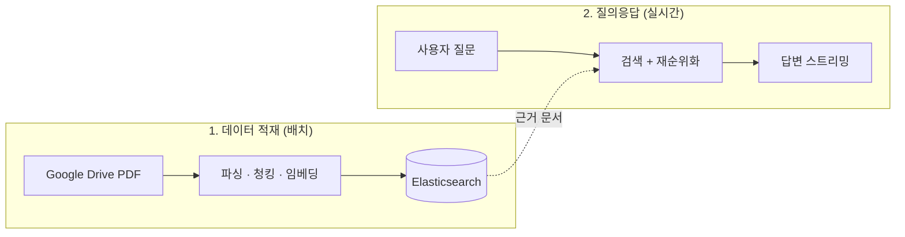
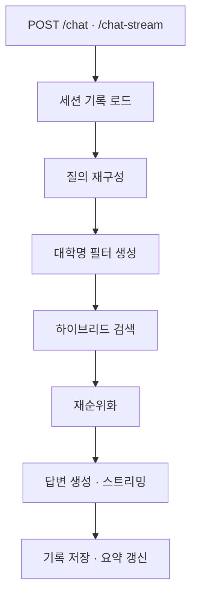
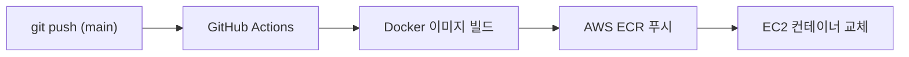

# HY_LLM_Chain — 대학 입시 상담 RAG 챗봇

모집요강 PDF를 색인해 근거 기반으로 답하는 한국어 입시 상담 RAG 서버입니다.
질문은 하이브리드 검색 → 재순위화 → LLM 생성 순서로 처리됩니다.


## 목차

- [프로젝트 개요](#프로젝트-개요)
- [빠른 시작](#빠른-시작)
- [워크플로우](#워크플로우)
  - [1. 데이터 적재 파이프라인 (배치)](#1-데이터-적재-파이프라인-배치)
  - [2. 질의응답 파이프라인 (실시간)](#2-질의응답-파이프라인-실시간)
  - [3. 배포 파이프라인 (CI/CD)](#3-배포-파이프라인-cicd)
- [사용 데이터](#사용-데이터)
- [사용 기술](#사용-기술)
- [디렉터리 구조](#디렉터리-구조)
- [평가](#평가)

## 프로젝트 개요

이 저장소는 입시 상담 AI "HY AI"의 **RAG 서버**입니다. 40여 개 국내 대학의 수시/정시 모집요강 PDF를 근거 데이터로 삼습니다. 질문이 들어오면 하이브리드 검색과 재순위화로 근거를 모으고, 출처가 있는 답변을 스트리밍으로 생성합니다.



전체 시스템은 세 개의 파이프라인으로 구성됩니다.

1. 데이터 적재 (배치) — PDF를 파싱·청킹·임베딩해 Elasticsearch에 색인
2. 질의응답 (실시간) — 근거를 모아 답변 생성, 대화 기록은 PostgreSQL에 저장
3. 배포 (CI/CD) — `main` 반영 시 Docker 이미지를 ECR을 거쳐 EC2에 배포

> [!NOTE]
> `KGS`는 이 프로젝트가 구글 시트와 색인 이름(`kgs_index`)에 사용하는 내부 데이터 코드명입니다.

## 빠른 시작

### 설치

Python 3.11 기준입니다(배포 이미지 `python:3.11-slim`).

```bash
pip install -r requirements.txt
```

### 환경 변수 (.env)

`.env` 파일로 관리하며 저장소에는 포함되지 않습니다. Google 서비스 키(`hygoogle-service-key.json`)도 동일합니다.

| 변수 | 용도 |
| --- | --- |
| `OPENAI_API_KEY` | 답변 생성 · 질의 재구성 · 요약 · 임베딩 |
| `COHERE_API_KEY` | 검색 결과 재순위화 |
| `ES_ENDPOINT`, `ELASTIC_API_KEY` | Elasticsearch |
| `DB_HOST`, `DB_USER`, `DB_PASSWORD`, `DB_PORT`, `DB_NAME` | PostgreSQL |
| `GCP_API_KEY` | Google Drive |
| `LANGCHAIN_TRACING_V2`, `LANGCHAIN_API_KEY`, `LANGCHAIN_PROJECT` | LangSmith 모니터링 |

### 서버 실행

```bash
# API 서버 (FastAPI, 8000 포트)
uvicorn es_server:app --host 0.0.0.0 --port 8000 --reload

# 테스트용 채팅 UI (Streamlit)
streamlit run app.py
```

> [!NOTE]
> 인덱스가 비어 있다면 [데이터 적재 파이프라인](#1-데이터-적재-파이프라인-배치)을 먼저 실행해야 답변이 생성됩니다.

### 요청 예시

`/chat`은 단건 JSON으로 응답합니다.

```bash
curl -X POST http://localhost:8000/chat \
  -H "Content-Type: application/json" \
  -d '{"session_id": "demo-1", "query": "한양대 수시 모집 인원 알려줘"}'
```

```json
{"answer": "한양대학교 2026학년도 수시 모집 인원은 ... 😊"}
```

`/chat-stream`은 NDJSON 스트리밍으로 응답합니다(`-N`: 버퍼링 해제).

```bash
curl -N -X POST http://localhost:8000/chat-stream \
  -H "Content-Type: application/json" \
  -d '{"session_id": "demo-1", "query": "한양대 수시 모집 인원 알려줘"}'
```

```json
{"token": "한양대학교"}
{"token": " 2026학년도 수시 모집 인원은"}
{"token": " 다음과 같습니다. ..."}
{"status": "done"}
```

## 워크플로우

답은 먼저 쌓아 둔 지식에서 나오고, 질문이 오면 그 지식을 찾아 답합니다 — 1번은 지식을 쌓는 배치 작업, 2번은 질문을 처리하는 실시간 작업입니다.

### 1. 데이터 적재 파이프라인 (배치)

Google Drive의 PDF를 읽어 Elasticsearch 색인까지 완성하는 오프라인 배치 과정입니다.


1. 수집 — `GoogleDriveManager`가 `모집요강 > 2026 > 수시` 폴더 계층을 순회하며 PDF를 내려받습니다.
2. 파싱 — 하나의 PDF를 3종 파서로 동시에 파싱합니다. 파서별 결과는 비교·앙상블을 위해 S3 `pdf_parsed/` 프리픽스에 각각 보관합니다.
3. 청킹 — 로마숫자, `제N장`, `가.`, `(1)` 등의 패턴으로 대·소제목 계층을 복원합니다. 표(`<table>`)는 통째로 분리하고, 제목만 있는 청크는 다음 본문과 병합합니다.
4. 형태소·임베딩 — Kiwi로 `text_morph` 필드를 만들고 임베딩 벡터를 생성합니다.
5. 색인 — `bulk`로 색인합니다. 본문·형태소·벡터·메타데이터가 한 문서에 함께 들어갑니다.

각 청크에 저장되는 메타데이터는 다음과 같습니다.

| 필드 | 의미 |
| --- | --- |
| `university` | 대학명 |
| `year` | 모집 연도 |
| `admission_type` | 수시 / 정시 |
| `document_type` | 문서 종류 |
| `section_main` / `section_sub` | 문서 섹션 계층 (대제목 / 소제목) |
| `type` | text / table / image |
| `page_number` | 페이지 번호 |
| `parser` | 청크를 생성한 파서 |

#### 실행

```bash
# PDF → 파서 → S3 저장만
python -m utils.rag_pdf_pipeline --step parse-only

# 위 단계 + 청킹 + Elasticsearch 색인까지 한 번에
python -m utils.rag_pdf_pipeline --step full
```

### 2. 질의응답 파이프라인 (실시간)

사용자 질문 1건이 답변으로 이어지는 온라인 처리 흐름입니다. 서버 실행 방법은 [빠른 시작](#빠른-시작)을 참고하세요.



1. 세션 기록 로드 — PostgreSQL에서 대화 기록과 요약을 불러옵니다. 서버 기동 시 세션 캐시를 미리 예열합니다.
2. 질의 재구성 — LLM이 질문에서 대학명 목록과 핵심 검색 문장(`rewritten_query`)을 분리합니다.
3. 대학명 필터 생성 — 추출한 대학명을 `config/university.json`으로 표준명으로 정규화해 메타데이터 필터(`+ 공통`)를 만듭니다.
4. 하이브리드 검색 — BM25(가중치 0.4)와 벡터 검색(0.6)을 `EnsembleRetriever`로 결합합니다.
5. 재순위화 — reranker가 상위 근거만 압축 추출합니다.
6. 답변 생성 — 근거·대화 요약·최근 대화를 프롬프트에 넣어 한국어 답변을 스트리밍합니다.
7. 저장 — 질문/답변을 PostgreSQL에 기록하고, 조건 충족 시 대화 요약을 백그라운드로 갱신합니다.

### 3. 배포 파이프라인 (CI/CD)

`main` 브랜치에 push하면 이미지 빌드부터 EC2 재배포까지 자동으로 이어지는 과정입니다.



1. 워크플로 정의는 `.github/workflows/es_rag.yaml`에 있습니다.
2. 이미지는 `dockerfile/es_rag_dock`으로 빌드됩니다.
3. EC2에서 `rag-es-container` 컨테이너가 `8001:8000` 포트 매핑으로 교체 기동됩니다.

> [!WARNING]
> 현재 이 워크플로는 자동 실행되지 않도록 **비활성화**되어 있습니다.
> 파일이 `.github/workflows/es_rag.yaml.disabled`로 보관되어 GitHub Actions가 인식하지 않습니다.
> 다시 켜려면 파일명을 `es_rag.yaml`로 되돌리고, 저장소 Secrets(`AWS_ACCESS_KEY_ID`, `EC2_HOST`, `OPENAI_API_KEY` 등)를 등록하세요.

## 사용 데이터

| 구분 | 내용 |
| --- | --- |
| 원본 문서 | 국내 대학 모집요강 PDF (Google Drive, `모집요강 > 2026 > 수시`) |
| 보조 데이터 | KGS 구글 시트 · 대학 별칭 사전 `config/university.json` (40여 개 대학) |
| 가공 데이터 | 파서별 RAW JSONL (AWS S3, `pdf_parsed/`) |
| 색인 데이터 | Elasticsearch `kgs_index` (본문 + 형태소 + 벡터 + 메타데이터) |
| 운영 데이터 | PostgreSQL 대화 기록(`qna_chat_history`) · 대화 요약 |

평가용 데이터와 결과는 [평가](#평가) 섹션을 참고하세요.

## 사용 기술

| 영역 | 기술 |
| --- | --- |
| API 서버 | FastAPI, Uvicorn (async 스트리밍) |
| RAG 프레임워크 | LangChain 0.3.x |
| 답변 LLM | OpenAI `gpt-4o-mini` |
| 질의 재구성 LLM | OpenAI `gpt-4.1-mini` |
| 요약 LLM | OpenAI `gpt-4.1-nano` |
| 임베딩 | OpenAI `text-embedding-3-large` (3072차원) |
| 재순위화 | Cohere `rerank-multilingual-v3.0` |
| 검색 엔진 | Elasticsearch (BM25 + kNN 하이브리드) |
| 한국어 형태소 | kiwipiepy (Kiwi) |
| PDF 파싱 | Upstage, LlamaParse, PyMuPDF4LLM |
| 운영 DB | PostgreSQL (SQLAlchemy Async, asyncpg) |
| 스토리지 | AWS S3 |
| 배포 | Docker, AWS ECR, EC2, GitHub Actions |
| 모니터링 | LangSmith |

체인 구성에는 LangChain의 `RunnableWithMessageHistory`, `EnsembleRetriever`, `ContextualCompressionRetriever`를 사용합니다. OpenSearch·Weaviate 기반 변형 실험은 `my_rag_project/`에 있습니다.

## 디렉터리 구조

```
HY_LLM_Chain/
├── es_server.py           # FastAPI 서버 (메인, Elasticsearch)
├── rag_model.py           # RAG 체인: ES 하이브리드 검색 + 앙상블 + 재순위화
├── app.py                 # Streamlit 테스트 채팅 UI
├── requirements.txt       # 의존성
├── config/
│   ├── config.yaml        # 모델·검색·인덱스 파라미터
│   └── university.json    # 대학 별칭 → 표준명 사전
├── dockerfile/es_rag_dock # 배포용 Docker 이미지 정의
├── utils/                 # 적재·검색·RDS·S3 유틸리티
│   ├── rag_pdf_pipeline.py    # PDF → 파싱 → 청킹 → ES 색인
│   ├── rag_filter_query.py    # 질의 재구성 + 대학명 정규화
│   ├── rag_retriever.py       # BM25 / 벡터 / rerank
│   └── ...                    # RDS(대화기록·요약), S3 IO 등
├── eval/                  # 검색 성능·MT-Bench·부하 테스트 결과
├── my_rag_project/        # OpenSearch·Weaviate 변형 및 실험 코드
└── .github/workflows/     # CI/CD (현재 비활성화)
```

## 평가

`eval/` 디렉터리에 평가 스크립트와 결과가 있습니다.

1. 검색 성능 — BM25·벡터·앙상블 리트리버를 MRR / nDCG / Count@k 지표로 비교 (`eval/db_test/`)
2. 답변 품질 — MT-Bench 평가 (`rag_mtbench.ipynb`)
3. 부하 테스트 — Locust (`eval/locustfile.py`)
