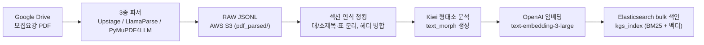
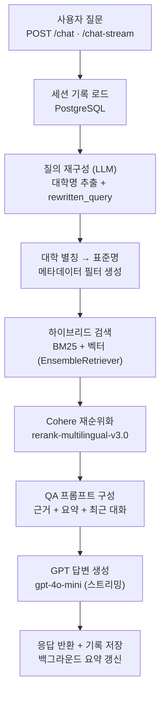
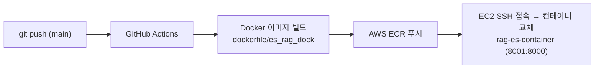

# HY_LLM_Chain — 대학 입시 상담 RAG 챗봇 (KGS Elasticsearch RAG)

> **한 줄 요약** — Google Drive에 쌓인 대학 **모집요강 PDF**를 자동으로 파싱·색인하고, 사용자의 질문을 **하이브리드 검색(BM25 + 벡터) → Cohere 재순위화 → GPT 생성**으로 답변하는 한국어 입시 상담 챗봇 백엔드입니다. FastAPI + LangChain 기반이며, Docker 이미지로 빌드되어 AWS EC2에 배포됩니다.

## 프로젝트 개요

이 저장소는 입시 상담 AI **"HY AI"**의 **RAG 서버**입니다. 40여 개 국내 대학의 수시/정시 모집요강을 근거 데이터로 삼아, 질문에 대해 **출처가 있는(근거 기반) 답변**을 스트리밍으로 제공합니다.

핵심 설계는 두 개의 독립된 파이프라인으로 나뉩니다.

- **① 데이터 적재 파이프라인 (배치)** — PDF를 3종 파서로 파싱하고, 섹션 구조를 살려 청킹한 뒤 임베딩하여 Elasticsearch에 색인합니다.
- **② 질의응답 파이프라인 (실시간)** — 질문에서 대학명을 분리해 메타데이터 필터를 만들고, 하이브리드 검색 + 재순위화로 근거를 모아 GPT가 답변을 생성합니다. 대화 기록과 요약은 PostgreSQL에 저장됩니다.

여기에 **③ 배포 파이프라인(CI/CD)** 이 더해져, `main` 브랜치에 반영하면 Docker 이미지가 ECR을 거쳐 EC2에 자동 배포됩니다. (본 저장소에서는 아래 [배포 파이프라인](#3-배포-파이프라인-cicd) 참고 — 현재 자동 실행은 비활성화 상태)

---

## 사용 데이터

| 구분 | 내용 |
| --- | --- |
| **원본 문서** | 국내 대학 **모집요강 PDF** (Google Drive 보관, 폴더 계층 `모집요강 > 2026 > 수시`) |
| **보조 데이터** | KGS 구글 시트, 대학 별칭 사전(`config/university.json`, 40여 개 대학 + 별칭) |
| **가공 데이터** | 파서별 RAW JSONL (AWS S3, `pdf_parsed/` 프리픽스) → 청크 문서 |
| **색인 데이터** | Elasticsearch 인덱스 (`kgs_index`) — 본문 텍스트 + 형태소 필드 + 3072차원 임베딩 벡터 + 메타데이터 |
| **운영 데이터** | PostgreSQL — 세션별 대화 기록(`qna_chat_history`), 대화 요약 |
| **평가 데이터** | `eval/` — BM25·벡터·앙상블 검색 성능(MRR/nDCG/Count@k), MT-Bench 평가, Locust 부하 테스트 |

각 청크는 다음 메타데이터를 함께 저장합니다: `university`, `year`, `admission_type`(수시/정시), `document_type`, `section_main`/`section_sub`(문서 섹션 계층), `type`(text/table/image), `page_number`, `parser`.

---

## 사용 기술

| 영역 | 기술 |
| --- | --- |
| **API 서버** | FastAPI, Uvicorn (async, 스트리밍 응답) |
| **RAG 프레임워크** | LangChain 0.3.x (`RunnableWithMessageHistory`, `EnsembleRetriever`, `ContextualCompressionRetriever`) |
| **LLM (OpenAI)** | 답변 `gpt-4o-mini` · 질의 재구성 `gpt-4.1-mini` · 요약 `gpt-4.1-nano` |
| **임베딩** | OpenAI `text-embedding-3-large` (3072d) |
| **재순위화(Rerank)** | Cohere `rerank-multilingual-v3.0` |
| **검색 엔진** | Elasticsearch (BM25 + kNN 벡터 하이브리드) — OpenSearch·Weaviate 변형도 실험(`my_rag_project/`) |
| **한국어 형태소** | kiwipiepy (Kiwi) |
| **PDF 파싱** | Upstage, LlamaParse, PyMuPDF4LLM (3종 병행) |
| **운영 DB** | PostgreSQL (SQLAlchemy Async, asyncpg) |
| **스토리지** | AWS S3 |
| **배포** | Docker → AWS ECR → EC2, GitHub Actions CI/CD |
| **모니터링** | LangSmith |
| **테스트/평가** | Streamlit(테스트 UI), Locust(부하), MT-Bench·검색 지표 |

---

## 워크플로우

### 1. 데이터 적재 파이프라인 (배치)

Google Drive의 PDF를 읽어 Elasticsearch 색인까지 완성하는 오프라인 배치 과정입니다.



1. **수집** — `GoogleDriveManager`가 `모집요강 > 2026 > 수시` 폴더 계층을 순회하며 PDF를 내려받습니다.
2. **파싱** — 하나의 PDF를 **3종 파서로 동시에** 파싱해 파서별 RAW JSONL을 S3에 저장합니다(파서 비교·앙상블 목적).
3. **청킹** — 로마숫자/`제N장`/`가.`/`(1)` 등의 패턴으로 **문서의 대·소제목 계층을 복원**하고, 표(`<table>`)는 통째로 분리, 제목만 있는 청크는 다음 본문과 병합합니다.
4. **형태소·임베딩** — Kiwi로 형태소 필드를 만들고 OpenAI 임베딩으로 벡터화합니다.
5. **색인** — `bulk`로 Elasticsearch에 색인합니다. 본문·형태소·벡터·메타데이터가 한 문서에 함께 들어갑니다.

**실행**

```bash
# PDF → 파서 → S3 저장만
python -m utils.rag_pdf_pipeline --step parse-only

# 위 단계 + 청킹 + Elasticsearch 색인까지 한 번에
python -m utils.rag_pdf_pipeline --step full
```

### 2. 질의응답 파이프라인 (실시간)

사용자 질문 1건이 답변으로 이어지는 온라인 처리 흐름입니다.



1. **요청 수신** — `/chat`(단건) 또는 `/chat-stream`(NDJSON 스트리밍)으로 `session_id`, `query`를 받습니다.
2. **세션 로드** — PostgreSQL에서 대화 기록과 요약을 불러옵니다(서버 기동 시 캐시 예열).
3. **질의 재구성** — LLM이 질문에서 **대학명 목록**과 **핵심 검색 문장(rewritten_query)** 을 분리합니다.
4. **필터 생성** — 추출한 대학명을 `university.json`으로 표준화해 메타데이터 필터(`+ 공통`)를 만듭니다.
5. **하이브리드 검색** — BM25(가중치 0.4)와 벡터 검색(0.6)을 `EnsembleRetriever`로 결합합니다.
6. **재순위화** — Cohere reranker로 상위 근거만 압축 추출합니다.
7. **생성** — 근거·요약·최근 대화를 프롬프트에 넣어 GPT가 한국어 답변을 스트리밍합니다.
8. **저장** — 질문/답변을 PostgreSQL에 기록하고, 조건 충족 시 **대화 요약을 백그라운드로 갱신**합니다.

**실행**

```bash
# 로컬 서버 (FastAPI, 8000 포트)
uvicorn es_server:app --host 0.0.0.0 --port 8000 --reload

# 테스트용 채팅 UI (Streamlit)
streamlit run app.py
```

### 3. 배포 파이프라인 (CI/CD)



`.github/workflows/es_rag.yaml`에 정의되어 있으며, `main` push 시 이미지 빌드 → ECR 업로드 → EC2 재배포를 수행합니다.

> ⚠️ **현재 이 워크플로는 자동 실행되지 않도록 비활성화되어 있습니다.**
> 파일이 `.github/workflows/es_rag.yaml.disabled`로 보관되어 GitHub Actions가 인식하지 않습니다.
> 다시 켜려면 파일명을 `es_rag.yaml`로 되돌리고, 저장소 Secrets(`AWS_ACCESS_KEY_ID`, `EC2_HOST`, `OPENAI_API_KEY` 등)를 등록하세요.

---

## 디렉터리 구조

```
HY_LLM_Chain/
├── es_server.py          # FastAPI 서버 (메인, Elasticsearch)
├── rag_model.py          # RAG 체인: ES 하이브리드 검색 + 앙상블 + 재순위화
├── app.py                # Streamlit 테스트 채팅 UI
├── config/
│   ├── config.yaml       # 모델·검색·인덱스 파라미터
│   └── university.json    # 대학 별칭 → 표준명 사전
├── dockerfile/es_rag_dock # 배포용 Docker 이미지 정의
├── utils/                # 적재·검색·RDS·S3 유틸리티
│   ├── rag_pdf_pipeline.py    # PDF → 파싱 → 청킹 → ES 색인
│   ├── rag_filter_query.py    # 질의 재구성 + 대학명 정규화
│   ├── rag_retriever.py       # BM25 / 벡터 / Cohere rerank
│   └── ...                    # RDS(대화기록·요약), S3 IO 등
├── eval/                 # 검색 성능·MT-Bench·Locust 부하 테스트 결과
├── my_rag_project/       # OpenSearch·Weaviate 변형 및 실험 코드
└── .github/workflows/    # CI/CD (현재 비활성화)
```

## 환경 변수

`.env`로 관리하며 저장소에는 포함되지 않습니다(`hygoogle-service-key.json`도 동일). 주요 항목:

```
OPENAI_API_KEY, COHERE_API_KEY
LANGCHAIN_TRACING_V2, LANGCHAIN_API_KEY, LANGCHAIN_PROJECT
DB_HOST, DB_USER, DB_PASSWORD, DB_PORT, DB_NAME     # PostgreSQL
ES_ENDPOINT, ELASTIC_API_KEY                        # Elasticsearch
GCP_API_KEY                                         # Google Drive
```
